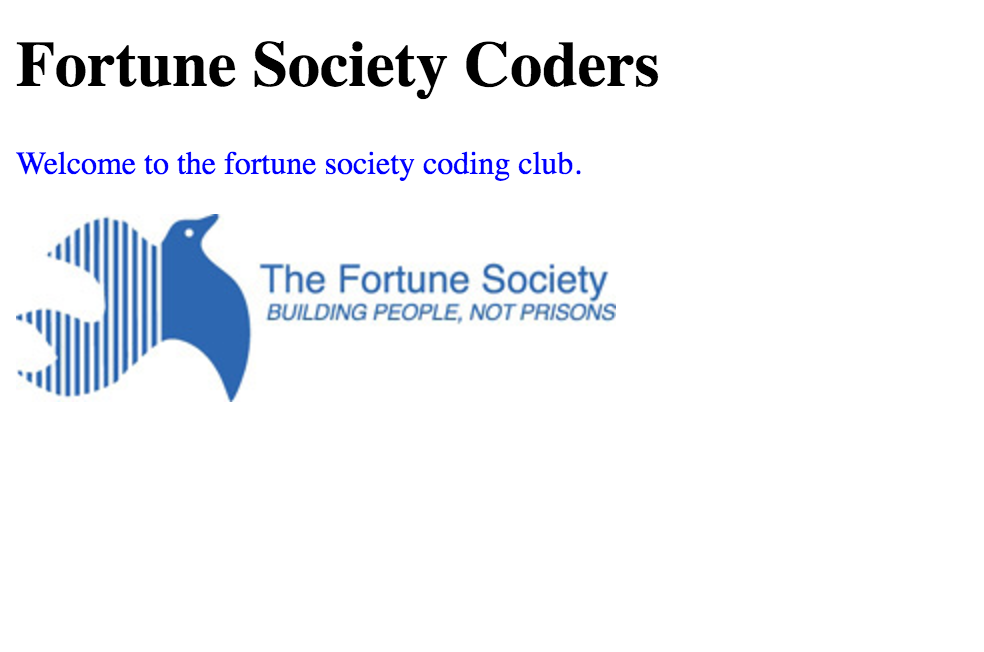

# Lesson 5 - Build Your Own Website

* Date: 11.15.16

## Today's Objectives

* Be able to ideate and build an HTML & CSS web page on JSBin
* Be able to use Google to search for how to build new things

## 1. Do Now (5 min)

Write down answers for the following questions:

1. List at least 3 social issues you would like to see solved.
2. Could any of them be solved through technology - at least in part? How?

## 2. Review of Concepts

### A. HTML

An **HTML tag** gives structure and meaning to the content of your website.

Syntax:

```html
<tag>content</tag>
```

Example:

```html
<p>This is a paragraph</p>

<a href=”http://youtube.com”>Click here to go to Youtube!</a>


```

### B. CSS

A **CSS rule** is a list of styles for an HTML element (selector).

Syntax:

```css
selector {
  property: value;
  property: value;
}
```

Example:

```css
p {
  color: red;
  background-color: blue;
}
```

### C. NEW: Classes

A **class** allows us to style certain HTML elements differently from the rest.

A class allows us to name an HTML element (p, h1, a, div), and refer to it in our CSS:
* To name or classify an element, we add the `class` attribute to its HTML tag.
* To refer to a class in CSS, we preface the class with a `.`

You can think of **classes** as **names** for HTML elements.

For example, if I want to style all my paragraphs a certain way, except for a particular paragraph, I can do the following:

```html
<p>This is a normal pagragraph</p>

<p>This is another normal paragraph</p>

<p class="special">This is a special paragraph</p>
```

```css
p {
  color: black;
  font-size: 16px;
}

.special {
  color: red;
  font-size: 20px;
}
```

### D. Exercise

With the help of your cheat sheet, fix the HTML and CSS for this website: http://jsbin.com/rasojef/1/edit?html,css,output

It should look like:



## 3. Build a Donation Website!

Using the HTML & CSS skills you've learned over the past
lessons, build a website that is an exact copy of this one:
http://alexq.in/fortune/donate

* Use JSBin to build this website (don't forget to sign in)
* Use Google to find out about HTML tags and CSS properties you haven't learned
* Refer to [lesson #1](https://github.com/noidontdig/fortune/blob/master/notes/lesson-1_10-11-16.md) to review HTML concepts
* Refer to [lesson #3](https://github.com/noidontdig/fortune/blob/master/notes/lesson-3_11-01-16.md) to review CSS concepts

## 4. Build Your Own Website

Using the HTML & CSS skills you've learned over the past
lessons, build a website that solves a problem.

### Plan

Spend ~20 minutes planning your website:
* Choose a problem you would like to solve
  * This can be big or small: a website that informs the public about their rights, a website that lists all the restaurants within walking distance of your home
  * Something related to the work the Fortune Society does
  * Something related to the results of the 2016 elections
  * Something that would help your family members
* Design a website that would help solve this problem
  * Answer the following question: **What is the goal of my website?**
  * Design the simplest possible version of your website (Minimum Viable Product) on a piece of paper
  * Make sure every element on your website design ladders up to the main goal
  * It should be simple enough that you can build it with the knowledge you already have (HTML & CSS)

### Build

* Use JSBin to build this website (don't forget to sign in)
* Use Google to find out about HTML tags and CSS properties you haven't learned
* Refer to [lesson #1](https://github.com/noidontdig/fortune/blob/master/notes/lesson-1_10-11-16.md) to review HTML concepts
* Refer to [lesson #3](https://github.com/noidontdig/fortune/blob/master/notes/lesson-3_11-01-16.md) to review CSS concepts

## 5. Homework

For Tuesday 11/22/16:

1. Finish your website
3. Practice typing on http://www.keybr.com
4. **Bonus:** Finish the [Codecademy HTML & CSS course](https://www.codecademy.com/learn/web)
