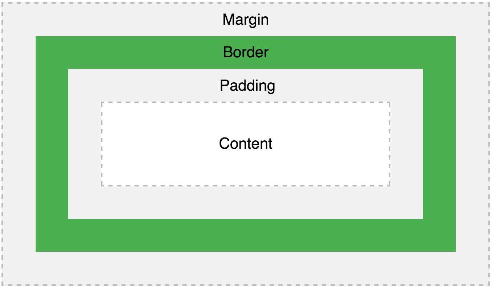

# Lesson 9 - Building Beautiful Layouts with HTML & CSS (continued)

* Date: 12.20.16

## Today's Objectives

* Be able to use HTML spans & divs, and CSS positioning to build layouts
* Be able to use Google to search for how to build new things

## 1. Do Now (10 min)

Prepare for your website demo:
* The demo should be 3 min long, and answer the following questions:
* What problem did you choose to solve?
* How does this website help sove the problem?
* List 1-3 new things you learned in order to build this website.
* What was the most challenging part?
* List 1-3 things you would like to change/add to your website.

## 2. Building Layouts with HTML & CSS

### A. `<span>` and `<div>`

* [w3schools lesson](http://www.w3schools.com/html/html_blocks.asp)

#### (1) `<div>` & block elements

A block-level element always starts on a new line and takes up the full width available (stretches out to the left and right as far as it can).

```
The <div> element is a block-level element.
```

Examples of block-level elements:
* `<div>`
* `<h1>` - `<h6>`
* `<p>`

#### (2) `<span>` & inline elements

An inline element does not start on a new line and only takes up as much width as necessary.

The `<span>` element is an inline element and can be placed inside other elements.

Examples of inline elements:
* `<span>`
* `<a>`
* ``

**`<div>` and `<span>` elements both define a section on the webpage, they simply follow different rules.**

### B. CSS classes

* [w3schools lesson](http://www.w3schools.com/cssref/sel_class.asp)

A **class** allows us to style certain HTML elements differently from the rest.

A class allows us to name an HTML element (p, h1, a, div), and refer to it in our CSS:
* To name or classify an element, we add the `class` attribute to its HTML tag.
* To refer to a class in CSS, we preface the class with a `.`

You can think of **classes** as **names** for HTML elements.

For example, if I want to style all my paragraphs a certain way, except for a particular paragraph, I can do the following:

```html
<p>This is a normal pagragraph</p>

<p>This is another normal paragraph</p>

<p class="special">This is a special paragraph</p>
```

```css
p {
  color: black;
  font-size: 16px;
}

.special {
  color: red;
  font-size: 20px;
}
```

### C. CSS layout properties

#### (1) `width` & `height`

* [w3schools lesson](http://www.w3schools.com/css/css_dimension.asp)

The `height` and `width` properties are used to set the height and width of an element.

```css
div {
  height: 100px;
  width: 500px;
  background-color: powderblue;
}
```

#### (2) `margin` & `padding`

* [w3schools lesson: Margins](http://www.w3schools.com/css/css_margin.asp)
* [w3schools lesson: Padding](http://www.w3schools.com/css/css_padding.asp)
* [w3school lesson: Box model](http://www.w3schools.com/css/css_boxmodel.asp)

The CSS `margin` properties are used to generate space around elements.

The margin properties set the size of the white space **outside** the border.

```css
div {
  margin-top: 100px;
  margin-bottom: 100px;
  margin-right: 150px;
  margin-left: 80px;
}

div {
  margin: 100px 150px 100px 80px;
}
```

The CSS `padding` properties are used to generate space around content.

The padding clears an area around the content (**inside the border**) of an element.

```css
div {
  padding-top: 50px;
  padding-right: 30px;
  padding-bottom: 50px;
  padding-left: 80px;
}

div {
    padding: 50px 30px 50px 80px;
}
```

The box model:



#### (3) `display`

* [w3schools lesson](http://www.w3schools.com/css/css_display_visibility.asp)

**The `display` property is the most important CSS property for controlling layout.**

The display property specifies if/how an element is displayed.

Every HTML element has a default display value depending on what type of element it is. The default display value for most elements is `block` or `inline`.

However, you can override this. Changing an inline element to a block element, or vice versa, can be useful for making the page look a specific way.

```css
a {
  display: block;
}
```

#### (4) `position`

* [w3schools lesson](http://www.w3schools.com/css/css_positioning.asp)

The `position` property specifies the type of positioning method used for an element.

There are four different position values:
* `static`
* `relative`
* `fixed`
* `absolute`

Elements are then positioned using the `top`, `bottom`, `left`, and `right` properties. However, these properties will not work unless the position property is set first.

```css
div.fixed {
  position: fixed;
  bottom: 0;
  right: 0;
  width: 300px;
  border: 3px solid #73AD21;
}
```

### D. Example: the German flag

Let's build the following layout in JSBin:


### E. Example: the Colombian flag

Let's build the following layout in JSBin:


## 3. Exercise: Flags! (1 hr)

Using the concepts above, build the following countries' flags:

* Germany
* Colombia
* Thailand
* France
* Japan
* Sweden
* Philippines
* Jamaica
* Greece
* Brazil
* USA
* Or, choose your favorite flag!

**Reminders:**
* Use Google to find out what the flag looks like
* Use w3schools color picker to find the right colors
* All your flags should be on the same webpage
* Use Google to find out more about CSS positioning
  * Remember: Ask yourself, then Google, then a friend, then Alex!

## 4. Exercise: What about your website? (10 min)

Now that you’ve learned more about creating visual layouts with
HTML and CSS:
* List 3 changes you can make to your website to make it more visually appealing
* Optionally, draw your updated design on a piece of paper

## 5. Homework

For the next cycle:

1. Using the skills you learned today, build on the layout of your site to make it more visually appealing
2. Finish the flag exercise
3. Practice typing on http://www.keybr.com
4. Finish the [Codecademy HTML & CSS course](https://www.codecademy.com/learn/web)
5. Take [General Assembly's HTML & CSS course](https://dash.generalassemb.ly/)
